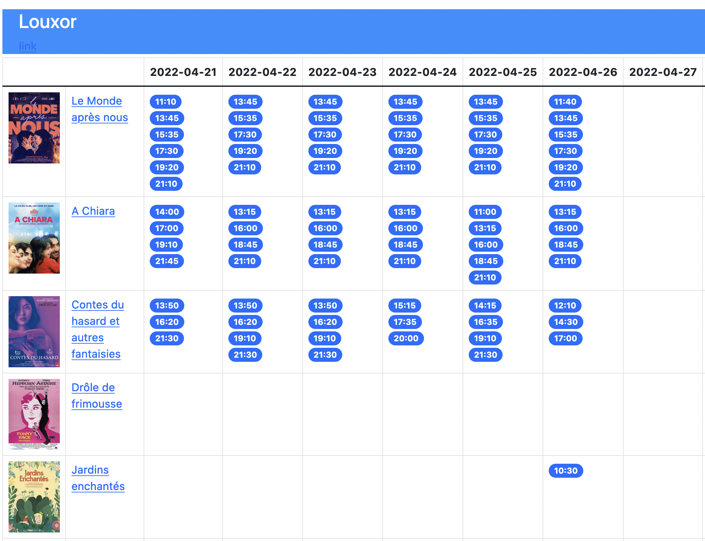

# Paris Cinema Scraper

## Why

Independent movie theatres in Paris are great. I don't know the details of how they organize themselves in detail, but I am aware of the association **Cinémas Indépendants Parisiens** and their [website](http://cip-paris.fr/) which I use to find which movies are playing in my area.

Unfortunately, I find the website difficult to navigate and its design not helpful in terms of UX. Most of the time I just want to know which movies are playing in my preferred theatre in the next days. Hence, I created this little project to scrape the movie data and render it into a single html file which presents the show times in a way that are the most helpful to me.

## What the result looks like

## How it works

1) scrapes the website of [Cinémas Indépendants Parisiens](http://cip-paris.fr/) using [Scrapy](https://scrapy.org/)
2) stores the data in a json file
3) loads the data and renders a single html file using [Jinja](https://jinja.palletsprojects.com/en/3.1.x/)
4) uploads the html file to an **AWS S3 bucket** which is configured to serve it as a static website
